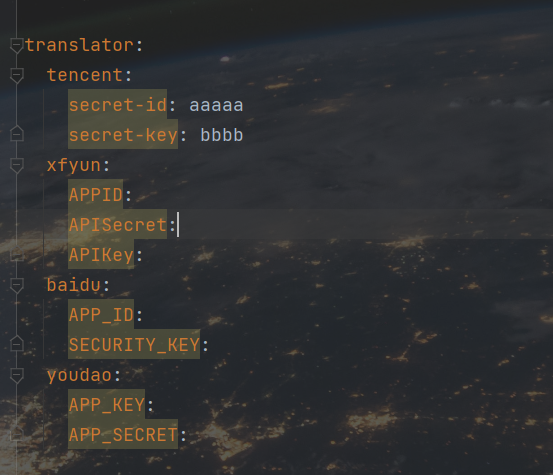

# Translator

#### 介绍
springboot项目（普通项目也可）中可以加入的一个翻译统一API,统一了腾讯，有道，百度，讯飞翻译接口，只需要在配置文件填入自己去官网注册的id和密钥登。全部免费，支持接口切换

#### 使用说明

+ 在application中 填入你去各个官方 注册的信息即可，他们都是有免费额度的 一般小项目免费版的就够用了
+ 我案例中使用了一个统一的json响应，可以根据自己的项目进行更改
> 我只是把他们统一了起来 并没有进行进一步优化 依赖方面应该可以更加的少

